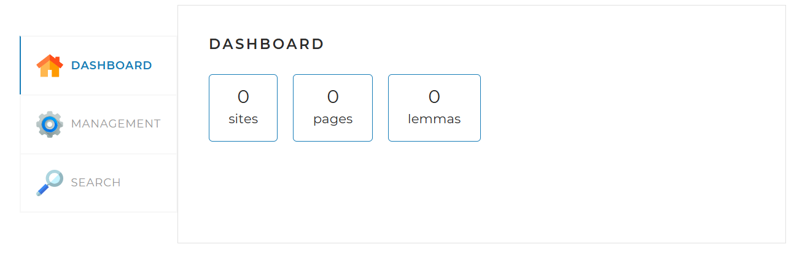
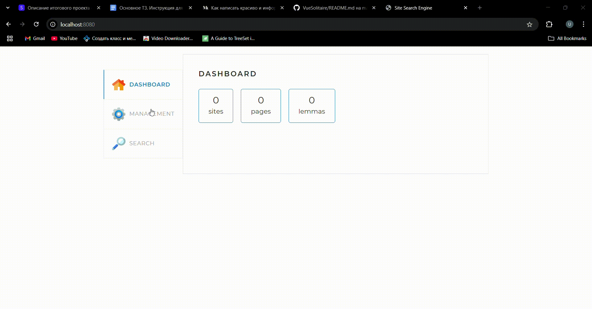

# Heliont Search Engine

---

---

## О проекте

Heliont Search Engine — это поисковый движок с веб-краулингом и индексированием, построенный на базе Java с использованием Spring Boot, Hibernate и MySQL. Проект поддерживает индексацию сайтов, лемматизацию контента для улучшения поиска, а также управление процессом индексации в многопоточном режиме.

Проект является учебным, демонстрирует принципы построения поисковых систем и взаимодействия с базой данных через JPA, обработку HTML с Jsoup, а также асинхронные вычисления с ForkJoin.

---

## Стек технологий

- Java 17
- Spring Boot 3.3.5
- Spring Data JPA / Hibernate
- MySQL 8
- Jsoup (HTML парсер)
- Apache Lucene Morphology (лемматизация)
- ForkJoinPool для многопоточной индексации
- Liquibase (управление миграциями базы данных)
- SLF4J + Logback (логирование)
- Maven (сборка проекта)

---

## Особенности

- Многопоточная индексация сайтов с ForkJoinPool
- Лемматизация русского и английского языка
- Интеграция с MySQL через Spring Data JPA
- Управление состояниями сайтов и страниц в базе данных
- REST API для получения статистики

---

---

## Локальный запуск проекта

### Предварительные требования

- Установленный JDK 17+
- MySQL сервер (локальный или удалённый)
- Maven 3.8+
- Git

---

### Шаги запуска
1. Клонируйте репозиторий:
git clone https://github.com/floodxv/heliont-search-engine heliont-search-engine
2. Настройте базу данных MySQL:
Создайте базу данных: CREATE DATABASE search_engine CHARACTER SET utf8mb4 COLLATE utf8mb4_unicode_ci;
В файле src/main/resources/application.yml отредактируйте параметры подключения к БД (username, password, url).
3. Соберите проект с помощью Maven:
mvn clean install
4. Запустите приложение:
mvn spring-boot:run
5. Откройте в браузере http://localhost:8080 для доступа к API и сервису.

Полезные ссылки:
- [Документация Spring Boot](https://spring.io/projects/spring-boot)
- [Jsoup](https://jsoup.org/)
- [Apache Lucene Morphology](https://lucene.apache.org/core/8_8_1/morphology/org/apache/lucene/morphology/package-summary.html)
- [Liquibase](https://www.liquibase.org/)

